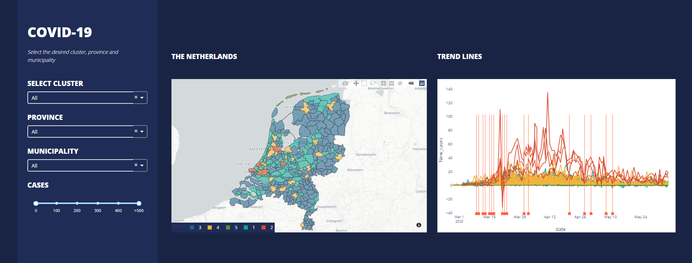

# Covid 19 Dashboard

This dashboard displays the different clusters across the Netherlands, according to the COVID-19 spread pattern.


## Screenshots


## How to use the app
Run this app locally by:
```
python app.py
```
Open http://127.0.0.1:8050/ in your browser.

## Data source
https://www.rivm.nl/

https://www.cbs.nl/
